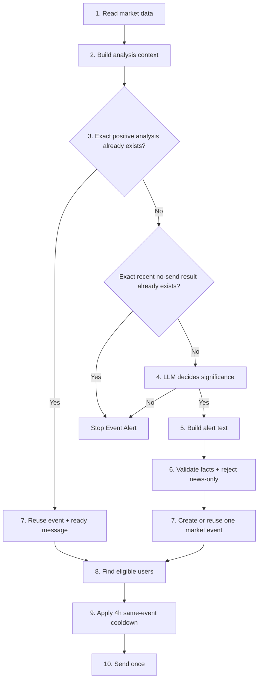

# Event Alert logic

Current flow, in simple form.



## Step 1 - Read the market
BTC, ETH, GRAM, and SOL are checked on the automatic schedule. Detection runs even when nobody is
currently eligible to receive that coin.

## Step 2 - Build the evidence
The bot prepares current price, recent snapshots, compact 30m/1h moves when reliable,
analysed-window and 24h moves, movement since the last message, 30-day relative-move context,
previous Event Alert context, recent 6h/24h Event Alert counts, and relevant news.

Numbers are evidence only. No backend numeric threshold decides whether an Event Alert is important.

## Step 3 - Reuse only exact previous work
Before new LLM calls, the bot checks whether this exact canonical context was already handled.

Two cases:
- an existing positive Event Analysis already has its event and rendered message -> reuse it and go
  straight to recipient checks;
- an exact recent context already ended with no alert / no delivery -> record the reuse and stop.

No rounding buckets or movement tolerances are used.

## Step 4 - Decide significance
If nothing can be reused, the significance LLM returns schema-validated `should_alert`, confidence,
and reason. Its default is no alert: the current market state must be important and materially new
enough to interrupt the user. Routine, modest, repeated, or continuing versions of the previous
alert are normally no-alert decisions; a genuinely noteworthy new move, clear escalation, or
meaningful reversal can alert. Direction alignment/divergence alone is not significance.

- `false` -> stop;
- news-only -> stop;
- `true` -> continue.

The significance reason must agree with the decision. Alert reasons
(`unusual_move`, `fast_move`, `reversal`, `trend_acceleration`,
`market_news_alignment`) are valid only with `should_alert=true`. Routine/unclear
no-alert reasons are valid only with `should_alert=false`; `news_only` is a no-alert
reason and remains backend-rejected even if a provider incorrectly pairs it with
`should_alert=true`. Other contradictory pairs are schema-invalid and do not proceed to render
or delivery.

## Step 5 - Build the message
Only a new positive decision gets the render LLM call. It writes presentation text only and cannot
change the significance decision.

If supported render failures exhaust the provider chain, the backend may build neutral deterministic
presentation text from the already validated market evidence.

## Step 6 - Validate the message
The backend validates schema and factual market claims. News may support the explanation, but a
standalone news-only Event Alert is rejected.

## Step 7 - Keep one event and one analysis
A newly detected event is created once. A reusable positive event keeps its already existing Event
Analysis and message.

Core rule:

```text
1 coin market event = 1 AI analysis = many deliveries
```

LLM calls never run inside the recipient loop.

## Step 8 - Find eligible users
Only now the bot checks delivery eligibility:
- coin enabled in watchlist;
- BTC is free;
- ETH, GRAM, and SOL require active Premium or trial;
- valid Telegram destination;
- duplicate chat IDs filtered.

Market Heartbeat frequency does not decide Event Alert eligibility.

## Step 9 - Block repeats for 4 hours
For each recipient, the same canonical event key or the same semantic family is blocked for four
hours.

No bypass exists for a bigger move, urgency, new news, or a direction change inside the same
semantic event. A genuinely different semantic event can pass.

## Step 10 - Send once
Delivery is idempotent. The bot records delivered, failed, filtered, cooldown, and suppression
outcomes and avoids sending the same event twice to the same recipient.

CoinGecko values keep full precision through analysis. Rounding is only for user-facing text.
