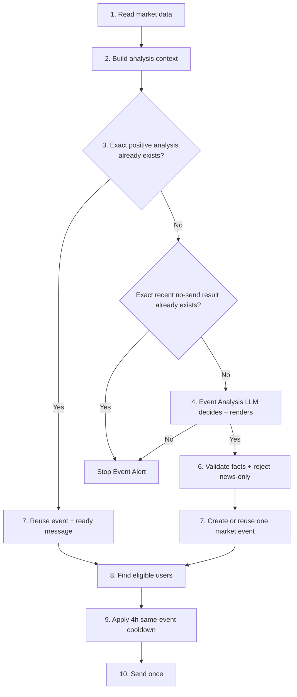

# Event Alert logic

Current flow, in simple form.



## Step 1 - Read the market
BTC, ETH, GRAM, and SOL are checked on the automatic schedule. Detection runs even when nobody is
currently eligible to receive that coin.

## Step 2 - Build the evidence
The bot prepares current price, recent snapshots, compact 30m/1h moves when reliable,
analysed-window and 24h moves, movement since the last message, 30-day relative-move context,
previous Event Alert context, recent 6h/24h alert-worthy market-event counts, and relevant news.

Numbers are evidence only. No backend numeric threshold decides whether an Event Alert is important.

## Step 3 - Reuse only exact previous work
Before new LLM calls, the bot checks whether this exact canonical context was already handled.

Two cases:
- an existing positive Event Analysis already has its event and rendered message -> reuse it and go
  straight to recipient checks;
- an exact recent context already ended with no alert / no delivery -> record the reuse and stop.

No rounding buckets or movement tolerances are used.

## Step 4 - Decide significance and render together
If nothing can be reused, one full Event Analysis LLM call decides `should_alert` and, only for a
positive decision, must also return the grounded Event Alert fields. Its default is no alert.

This one-stage contract is intentional. Production evidence showed that the compact significance-only
classifier introduced in October 2026 over-classified routine current moves because it could choose a
positive label such as `fast_move` or `reversal` without having to construct a grounded alert from
the same evidence. The full decision contract requires the model to make one coherent judgement:
the current move must be materially noteworthy, materially new enough to interrupt the user, and
strong enough to support the alert it returns.

The model must reason in this order:

1. **Materiality** — is the current market move itself materially noteworthy for this asset?
2. **Novelty** — if material, is it materially new versus recent Event Alerts and recent
   alert-worthy market events?
3. **Grounding** — if both are satisfied, can the supplied current market evidence support the
   returned title/message without inventing significance?

The 30m/1h path, analysed-window move, 24h move, 30-day same-asset percentiles, previous Event Alert,
recent 6h/24h event counts, and news are evidence only. A large 24h move, opposite direction versus
24h, news, or a short-window speed difference does not by itself upgrade a routine current move.
Previous alerts and recent-event counts can reduce novelty but cannot increase materiality.

There is still no deterministic numeric threshold in the backend. Percentages, historical
percentiles, and calibration examples are evidence for the LLM, not hard gates.

## Step 5 - Build the message
There is no separate render LLM call in the active Event Alert path. A positive Event Analysis must
return its grounded alert text in the same schema-validated response that made the significance
decision. A negative decision returns no alert text.

Keeping decision and grounding in one model response prevents a small classifier from rationalizing
a positive label independently of the message it would need to justify.

## Step 6 - Validate the message
The backend validates the one-stage Event Analysis schema and factual market claims. News may support
the explanation, but a standalone news-only Event Alert is rejected. Invalid output falls through the
normal provider fallback path and never proceeds to delivery.

## Step 7 - Keep one event and one analysis
A newly detected event is created once. A reusable positive event keeps its already existing Event
Analysis and message.

Core rule:

```text
1 coin market event = 1 AI analysis = many deliveries
```

LLM calls never run inside the recipient loop.

## Step 8 - Find eligible users
Only now the bot checks delivery eligibility:
- coin enabled in watchlist;
- BTC is free;
- ETH, GRAM, and SOL require active Premium or trial;
- valid Telegram destination;
- duplicate chat IDs filtered.

Market Heartbeat frequency does not decide Event Alert eligibility.

## Step 9 - Block repeats for 4 hours
For each recipient, the same canonical event key or the same semantic family is blocked for four
hours.

No bypass exists for a bigger move, urgency, new news, or a direction change inside the same
semantic event. A genuinely different semantic event can pass.

## Step 10 - Send once
Delivery is idempotent. The bot records delivered, failed, filtered, cooldown, and suppression
outcomes and avoids sending the same event twice to the same recipient.

CoinGecko values keep full precision through analysis. Rounding is only for user-facing text.
