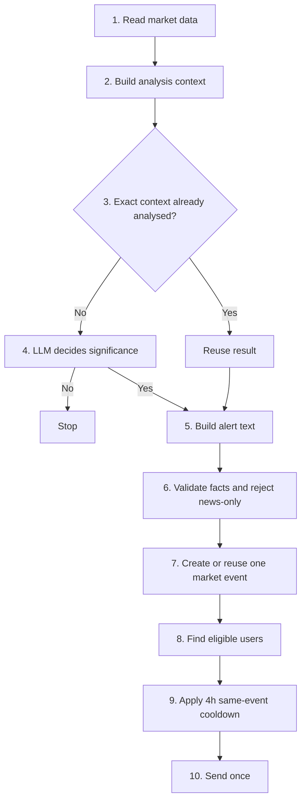

# Event Alert logic

Current flow, in simple form.



## Step 1 - Read the market
BTC, ETH, GRAM, and SOL are checked on the automatic schedule. Detection runs even when nobody is
currently eligible to receive that coin.

## Step 2 - Build the evidence
The bot prepares current price, recent snapshots, analysed-window move, 24h move, movement since the
last message, 30-day relative-move context, previous Event Alert context, and relevant news.

Numbers are evidence only. No backend numeric threshold decides whether an Event Alert is important.

## Step 3 - Reuse only an exactly identical context
Before an LLM call, the bot checks for the same canonical analysis context. Reuse is allowed only for
an exact semantic match. No rounding buckets or movement tolerances.

## Step 4 - Decide significance
The significance LLM returns schema-validated `should_alert`, confidence, and reason.

- `false` -> stop.
- news-only -> stop.
- `true` -> continue.

## Step 5 - Build the message
A second LLM call writes presentation text only. It cannot change the significance decision.

If supported render failures exhaust the provider chain, the backend may build neutral deterministic
presentation text from the already validated market evidence.

## Step 6 - Validate the message
The backend validates schema and factual market claims. News may support the explanation, but a
standalone news-only Event Alert is rejected.

## Step 7 - Create one market event
One detected coin event gets one durable Event Analysis. The same analysis can be delivered to many
users. LLM calls never run inside the recipient loop.

## Step 8 - Find eligible users
Only now the bot checks delivery eligibility:
- coin enabled in watchlist;
- BTC is free;
- ETH, GRAM, and SOL require active Premium or trial;
- valid Telegram destination;
- duplicate chat IDs filtered.

Market Heartbeat frequency does not decide Event Alert eligibility.

## Step 9 - Block repeats for 4 hours
For each recipient, the same canonical event key or the same semantic family is blocked for four
hours.

No bypass exists for a bigger move, urgency, new news, or a direction change inside the same
semantic event. A genuinely different semantic event can pass.

## Step 10 - Send once
Delivery is idempotent. The bot records delivered, failed, filtered, cooldown, and suppression
outcomes and avoids sending the same event twice to the same recipient.

## Core rule

```text
1 coin market event = 1 AI analysis = many deliveries
```

CoinGecko values keep full precision through analysis. Rounding is only for user-facing text.
