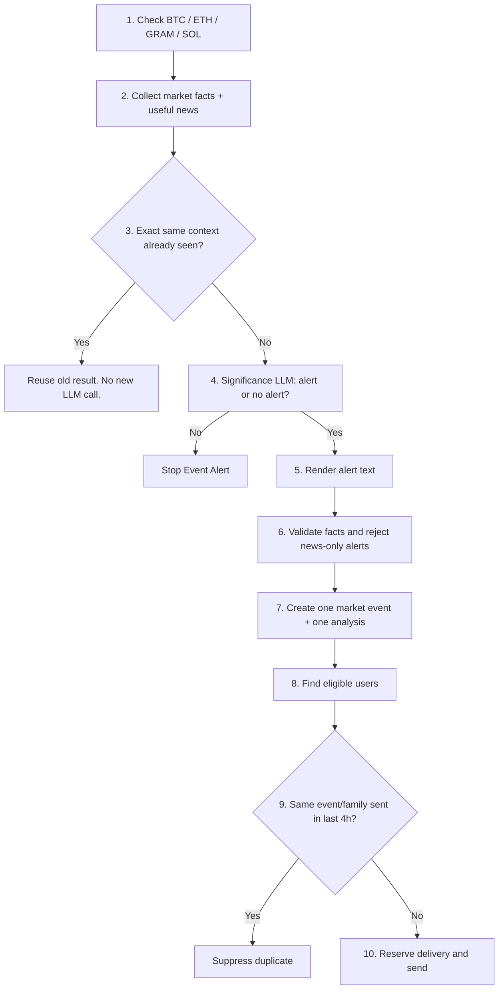

# Event Alert logic

This file explains the current Event Alert path in simple steps.

## Short version

## Steps

**Step 1 - Run the check.**  
Each supported coin - BTC, ETH, GRAM, SOL - has its own staggered automatic job. The configured
default cadence is 30 minutes.

**Step 2 - Build the evidence.**  
CCWBot takes full-precision price data, recent snapshots, the analysed-window move, 24h move,
movement since the previous Event Alert, 30-day relative-move context, and up to a few relevant news
items. News is supporting context, not the trigger by itself.

**Step 3 - Avoid doing the same thinking twice.**  
If the meaningful Event Analysis input is exactly unchanged, CCWBot can reuse the previous durable
result instead of calling the LLM again. This is exact matching - no rounding buckets or
"close enough" tolerance.

**Step 4 - Decide whether the move matters.**  
A small schema-validated significance LLM call returns `should_alert`, confidence, and a reason
code. Backend code does not use a fixed price-change or percentile threshold to decide significance.

**Step 5 - Write the alert only after "yes".**  
If `should_alert=false`, the Event Alert stops. If `true`, a second LLM call writes the
presentation text. If that render call fails in expected provider/schema ways, CCWBot builds safe
presentation text deterministically from the same market facts.

**Step 6 - Check the text against facts.**  
The backend validates market claims, time-window claims, news IDs, and schema fields. A news-only
decision is rejected. Standalone news-driven alerts are disabled by default.

**Step 7 - Make one shared event.**  
One coin market event gets one durable Event Analysis. The analysis is created once and can be sent
to many users. LLM calls never run inside the recipient loop.

**Step 8 - Find who may receive it.**  
Detection happens even if nobody can receive the alert. BTC delivery is free. ETH, GRAM, and SOL
require an enabled watchlist choice plus active Premium access.

**Step 9 - Block repeats for four hours.**  
For each recipient, the same canonical event key or the same semantic family is suppressed for a
strict 4 hours. Urgency, a larger move, new news, or direction does not bypass this rule. A genuinely
different event is allowed.

**Step 10 - Send only once.**  
CCWBot reserves each user/event delivery before Telegram send. An already delivered event is not sent
again. Transient Telegram failures are retried; permanent blocked-user failures can disable future
delivery to that user.

## Important rules

- Market numbers are evidence for the LLM, not backend alert thresholds.
- Detection is global; user eligibility is checked only for delivery.
- Exact Context Reuse and the 4-hour Semantic Cooldown are different protections.
- "No Event Alert" does not stop normal Market Heartbeat delivery when that heartbeat is due.
- User-facing formatting may round numbers; Event Analysis keeps source precision.
